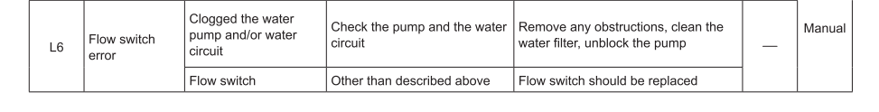
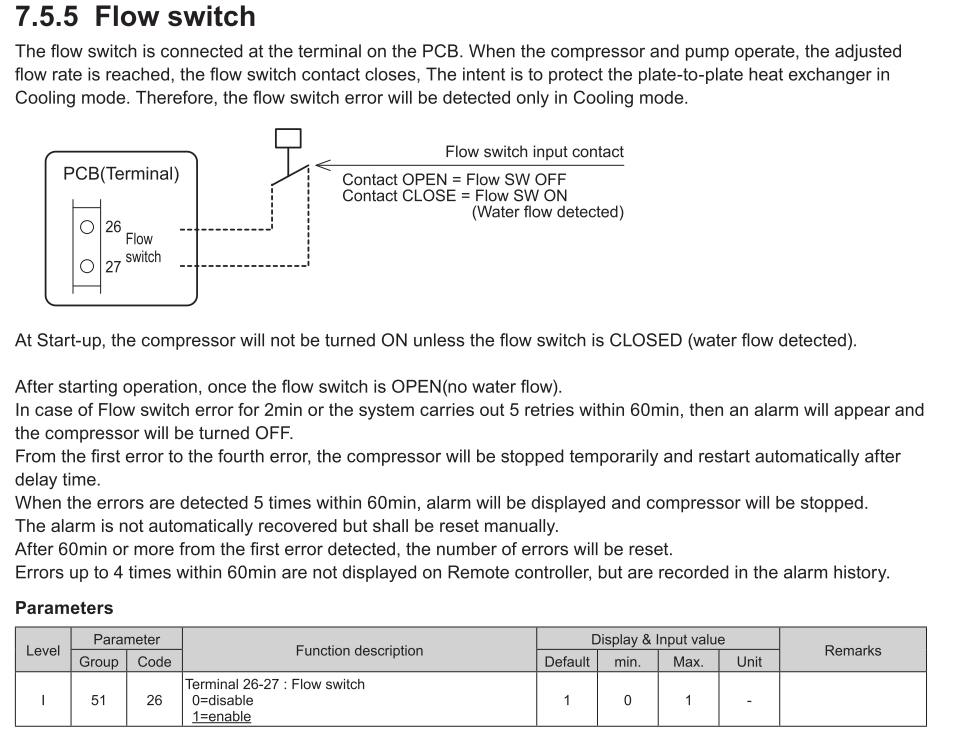

Cooling on the Grant Aerona3 / Chofu R32 air-source heat pumps
==============================================================

**Disclaimer: This section is only for people with some understanding of
heating systems and competence in electrical wiring.  Everything here is an
experimental work in progress.  It may be wrong and may damage your heat
pump.  Proceed at your own risk!  Corrections or additions welcome: please
open a Github Issue to comment.**

The Grant Aerona3 / Chofu R32 heat pumps support cooling mode, but this
information has been deleted from the Grant documentation.  The following
describes how to activate cooling mode.  At present this has been tested to
work but not fully put into service.

## 1. Room controller

Cooling mode can be activated via the room controller:

Grant's installation instructions say you don't need to touch this in
general use, and so installers may mount this somewhere inconvenient.

This controller is actually a full 7 day programmer and controller, for both
heating and cooling, and so you may first wish to move it somewhere more
accessible.  Consult section 3.7 in the
[Chofu installation instructions](../Chofu/R32/New-Zealand/Chofu-Operating-Installation-Manual-R32.pdf)
for details on how this should be wired.

Note that Grant's manual removes a lot of text about what the room
controller does and how it is set up - you should read the Chofu manual for
more details about what it actually does.

## 2. Enable cooling mode

As shipped, the ASHP is set to require a dry contact (between terminals 24
and 25) on the control PCB to activate cooling mode, ie parameter 5124 is
set to 1:

This disables the cooling button on the room controller.  You need to set
parameter 5124 to zero, and then the cooling button will enable,  (11) on
the room controller diagram above (page 28 of the Chofu R32 manual):

## 3. Flow switch

If you now press the 'snowflake' button, cooling mode will engage but it
will shortly then fail with error L6, flow switch error:

The flow switch is a safety protection for the heat exchanger inside the
ASHP in cooling mode.  Due to the risk of freezing the fluid if there
was a blockage in the water loop, the ASHP expects a switch to connect
terminals 26 and 27 when water flow is detected in the water loop.  Error L6
will be triggered if this switch does not close when water is expected to
flow:

It is strongly recommend that you install a switch, but it is possible to
bypass this error by setting parameter 5126 to 0 to disable flow switch
detection.  In this case you will need to ensure that your water loop is
never obstructed (eg by all zone valves being closed) - if you have a buffer
tank then the loop should operate even if no zones are open.

[An example flow switch (not a recommendation)](https://www.caleffi.com/international/en-int/catalogue/flow-switch-suitable-1-8-pipes-626600):

## 4. Cooling mode

Once the system is happy you can now enable cooling mode with the snowflake
button, which will chill the water output (down to the default of 7°C).

When activated, first the system will purge the water loop down to outdoor
temperature using the fan and pump only.  This takes about 200W.  This is
important if you have a buffer tank and have recently done a hot water
cycle: you don't want to pay to run the compressor to cool water down that
you recently heated up.

Once the water loop is at ambient temperature, the compressor will kick in
and engage refrigeration, which will gradually reduce the output temperature
to the desired cooling temperature.

## 5. Emitters

Your system needs to be designed for cooling.  There are two issues you need
to confront: cold air sinks, and cold emitters (and pipes) attract condensation.

A traditional radiator system is not good for this: a cold radiator forms a
pool of cold air near to it, but with no convection it does not spread
across the room (it needs a fan).  Also cold radiators and pipes (including
pipes in walls/ceilings/etc) will sweat due to the condensation.  Neither
are good.

Better emitters are water-based fan coils and in some cases underfloor
heating.

## 6. Pumps and controls

If wired as Grant suggest as a typical S-plan with external thermostat, the
controls will likely be wrong.  For example, a thermostat may 'call for
heat', turning on a valve for your radiators, the pump and asking the ASHP
to activate.  When the room goes above target temperature it will switch
everything off.

For cooling you want a 'call for cold', turning *on* if above target
temperature.  The traditional thermostat is all wrong for this.

The ASHP in fact has its own room controller, which is capable of
dealing with heating and cooling, and supports two zones plus hot water.
It is possible to wire this instead of an external thermostat.

More details on various possibilities of configuring different kinds of
system are given in Section 7 of the Chofu R32 installation manual.

Please note that the ASHP outputs to control pumps and valves are mostly
only rated at 230V 1A: this means they are not able to drive most inductive
loads directly.  Additional contactors or other switching circuits may be
required.
